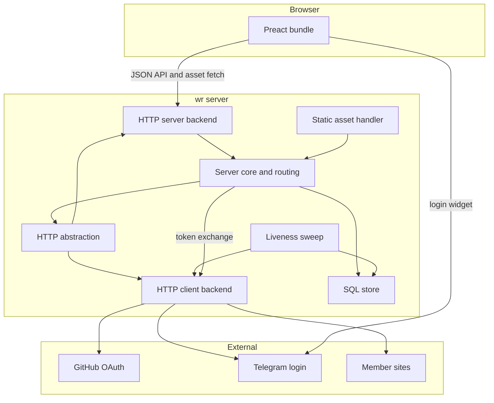
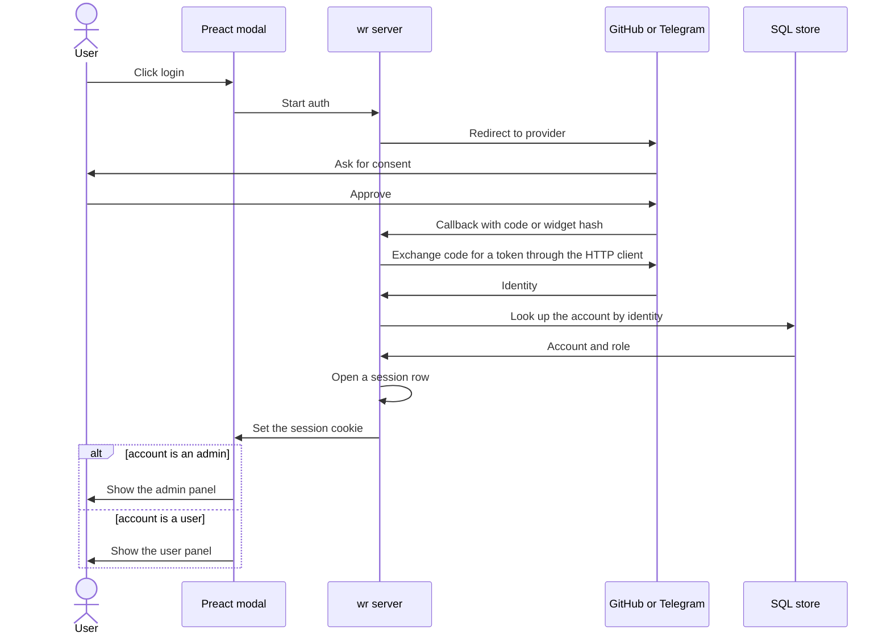
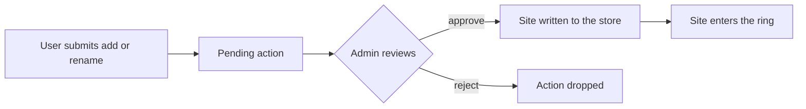
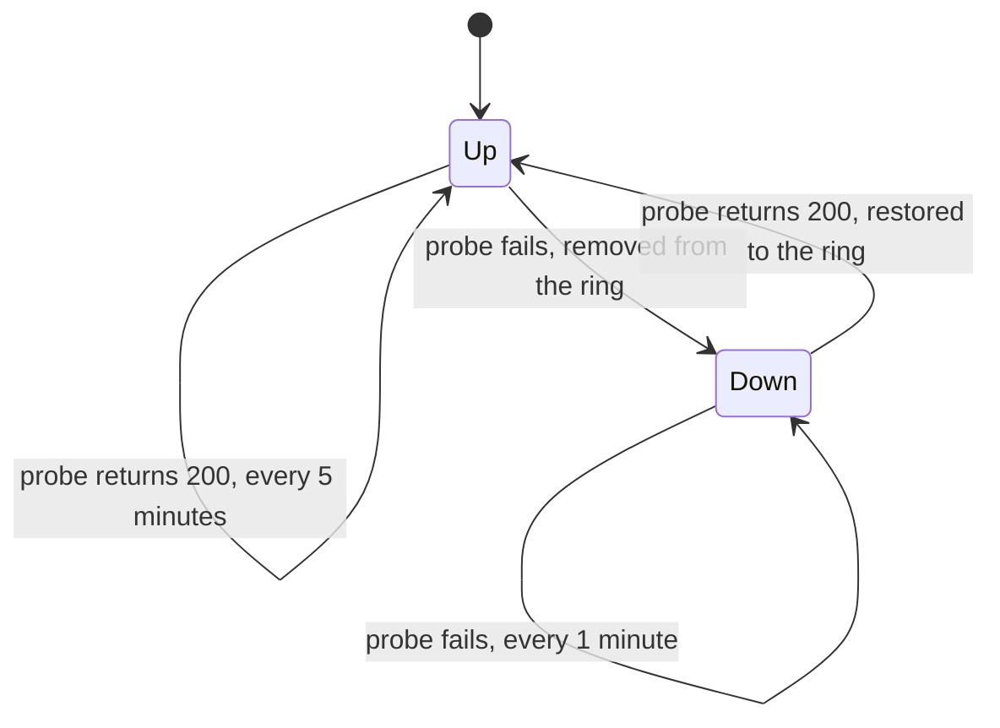

# wr architecture

wr is a C++ webring backend. It lists member sites and contains a user panel
and an admin panel behind GitHub and Telegram sign-ins. Preact is used on the
frontend.

This document describes the architecture.

## Components

The server core opens the database, builds the server, starts the liveness sweep
on its own thread, and runs the loop. The outbound layer uses a generic HTTP
client for the liveness probes and the OAuth token exchange. The store maps the
rows over an abstract SQL database, and the concrete sqlite backend owns the
connection and the prepared statements. A compiled statement is cached by the
backend keyed by its sql, so a repeated query is reset instead of recompiled.
The store runs the migration over the borrowed backend.

The frontend is a static Preact bundle served as an asset.



## Login and OAuth

A login starts in the modal and ends with a session cookie. The account is looked
up in the store, and the role decides the panel.



## Data model

The store holds seven kinds of rows.

- A site holds a slug, a pretty name, a url, a description, a reachability state,
  a last seen time, an owner, a created time, and a deleted flag. The slug keys
  the navigation, and a removal sets the deleted flag rather than dropping the
  row.
- A panel user holds an identity from a provider and a display name.
- An admin holds an identity that is allowed into the admin panel.
- A session holds a token, the identity it belongs to, and an expiry.
- A pending action holds a kind that is an add or a rename, the owner who
  requested it, the target site, the requested payload, and a status.
- A liveness bucket holds a site slug, an hour, and the up and probe counts for
  that hour. Seven days of buckets are kept and the rest are rotated out.
- A reaction holds a site slug, an emoji, and the identity that reacted. The row
  is a toggle, so a second react by the same identity removes it.

A site is added to the ring only after an admin approves a pending action.

## Panels and the pending-action workflow

The user panel shows only the sites the caller owns, and it offers a rename and
an add. Either action is written as a pending action. The admin panel shows
every site and every pending action. An admin edits any site, and an admin
approves or rejects a pending action. An approval writes the site into the
store and the site joins the ring once the liveness sweep sees it reachable.



## Public API and routing

The HTTP layer routes a request to the page renderer, the JSON API, the auth
endpoints, or the static asset handler. The navigation API is read-only and
serves the ring. The public navigation API is documented at /docs, separate from
the internal panel API. A textual client such as curl is answered with the JSON
form of a route while a browser is given the page.

```mermaid
flowchart TD
  req[Incoming request] --> router{Route by path}
  router -->|/sites| list[List active sites]
  router -->|/{slug} and variants| nav[Navigation]
  router -->|/auth and /oauth| auth[Auth endpoints]
  router -->|/api/panel| panel[Panel API behind the session]
  router -->|/docs| docs[Public API docs page]
  router -->|everything else| asset[Static asset]
  nav -->|/{slug}| redirect[Redirect to the site]
  nav -->|/{slug}/data| data[Navigation data]
  nav -->|/{slug}/next and /prev and /random| step[Step the ring]
```

A dev mode is turned on by the `--dev` flag. It exposes a login bypass at
/auth/dev for an admin or a user, and the client reads the dev state and the
configured providers from /api/config. Outside dev mode the server refuses to
start without a login provider and a session key.

### API

The JSON API is described in [openapi.yaml](openapi.yaml).

## Liveness sweep

The sweep runs on its own thread and wakes every minute. An up site is probed
every five minutes. A failed probe marks the site down and takes it out of the
active ring, and a down site is then probed every minute. A 200 restores the
failed site to the ring. The reachability and the last seen time are recorded on
every probe.



## Build and deploy

The build is exceptionless and ships a static release binary, with the debug,
release, coverage, and cosmopolitan modes. The vendored mongoose, sqlite, curl,
and mbedtls C sources are compiled into the same object tree. The release
binary is shipped to the inventory hosts by an ansible playbook. The detail of
the modes, the vendoring, and the deploy is held in CLAUDE.md.
