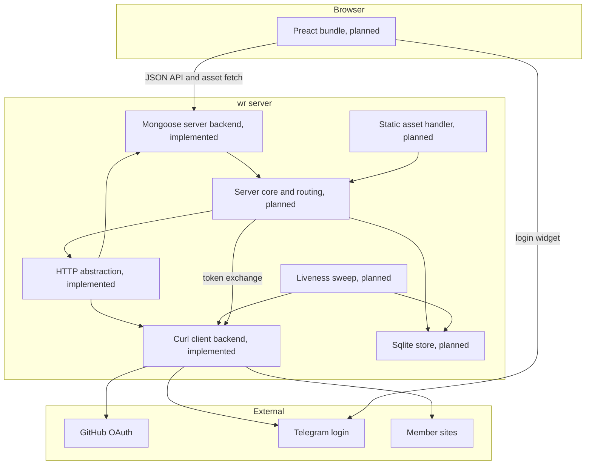
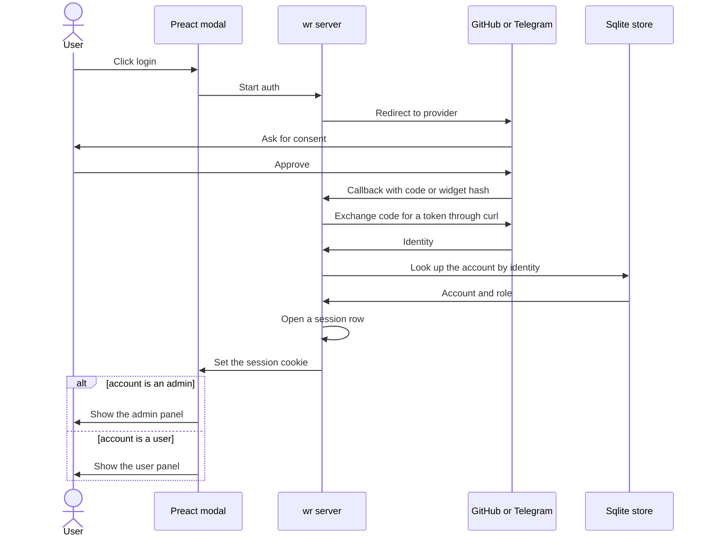
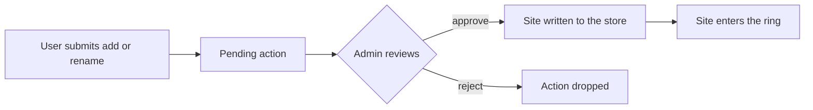
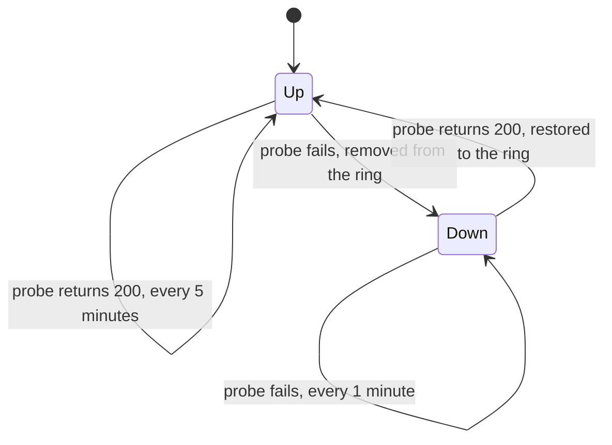

# wr architecture

wr is a C++ and C webring backend. A dynamic page lists the member sites, a user
panel and an admin panel are served behind a session, GitHub and Telegram drive
the login, and a periodic liveness check keeps the ring honest. The dynamic
frontend is a Preact bundle, and the boundary between the server and the frontend
is a JSON API.

This document describes the target architecture. Each part is marked with its
status. The build follows this document as the design reference.

## Status

- Implemented, the HTTP abstraction and its curl and mongoose backends, the
  container and allocator foundation, the StringMap, the CLI, the error types,
  the logger, and the vendoring of mongoose, curl, mbedtls, and sqlite.
- Planned, the sqlite store, the schema, the routing layer, the public
  navigation API, the sessions, the GitHub and Telegram auth, the user and admin
  panels, the pending-action workflow, the liveness sweep, the static asset
  serving, and the Preact frontend.

## Components

The server core opens the store, builds the mongoose event manager, registers
the routes and the liveness timer, and runs the loop. The outbound layer wraps
curl over mbedtls for the liveness probes and the OAuth token exchange. The
inbound layer wraps mongoose for the HTTP server. The store owns the sqlite
connection, the migration, and the prepared statements. The frontend is a static
Preact bundle served as an asset.



## Frontend

The frontend is a Preact application under the web directory, and its build is
served by mongoose as a static asset. The server renders no HTML beyond the
bootstrap shell.

- The landing page lists the active member sites and carries the login button in
  the top bar.
- The about page holds the project text and the links to b4cksp4ce.
- The user control panel and the admin control panel are views behind the
  session cookie, and they share one template.

The login button opens a modal that offers the GitHub OAuth and the Telegram
login widget. The account is matched against the store, and an admin is routed to
the admin panel while every other account is routed to the user panel. A visitor
lands on a panel based on the rows the store holds for the account.

## Login and OAuth

A login starts in the modal and ends with a session cookie. The account is looked
up in the store, and the role decides the panel.



## Data model

The store holds five kinds of rows.

- A site holds a slug, a pretty name, a url, an optional favicon, a reachability
  state, a last seen time, and an owner. The slug keys the navigation.
- A panel user holds an identity from a provider and a display name.
- An admin holds an identity that is allowed into the admin panel.
- A session holds a token, the identity it belongs to, and an expiry.
- A pending action holds a kind that is an add or a rename, the owner who
  requested it, the target site, the requested payload, and a status.

A site is added to the ring only after an admin approves a pending action, and
the approval writes the slug, the url, and the pretty name the user supplied.

## Panels and the pending-action workflow

The user panel shows only the sites the caller owns, and it offers a rename and
an add. Either action is written as a pending action rather than applied
directly. The admin panel shows every site and every pending action. An admin
edits any site, and an admin approves or rejects a pending action. An approval
writes the site into the store and the site joins the ring once the liveness
sweep sees it reachable.



## Public API and routing

The HTTP layer routes a request to the page renderer, the JSON API, the auth
endpoints, or the static asset handler. The navigation API is read-only and
serves the ring.

```mermaid
flowchart TD
  req[Incoming request] --> router{Route by path}
  router -->|/sites| list[List active sites]
  router -->|/{slug} and variants| nav[Navigation]
  router -->|/auth and /oauth| auth[Auth endpoints]
  router -->|/api/panel| panel[Panel API behind the session]
  router -->|everything else| asset[Static asset]
  nav -->|/{slug}| redirect[Redirect to the site]
  nav -->|/{slug}/data| data[Navigation data]
  nav -->|/{slug}/next and /prev and /random| step[Step the ring]
```

The Sites and Navigation endpoints are these.

- GET /sites lists the active sites.
- GET /{slug} redirects to the site.
- GET /{slug}/data returns the site data with the navigation.
- GET /{slug}/next and GET /{slug}/prev and GET /{slug}/random redirect to the
  neighbour or to a random site.
- GET /{slug}/next/data and /{slug}/prev/data and /{slug}/random/data return that
  site's data instead of redirecting.

The schemas are these. A WebringWebsite holds a slug, a name, a url, and an
optional favicon. A WebringWebsiteNavigationData holds a previous, a current, and
a next, each a PublicSite.

## Liveness sweep

The server probes each approved site on a periodic mongoose timer through the
curl client. An up site is probed every five minutes. A failed probe moves the
site down and takes it out of the ring, and a down site is then probed every
minute. A 200 restores the site to the ring. The reachability and the last seen
time are recorded on every probe.



## Build and deploy

The build is exceptionless and ships a static release binary, with the debug,
release, coverage, and cosmopolitan modes driven by the Makefile. The vendored
mongoose, sqlite, curl, and mbedtls C sources are compiled into the same object
tree. The release binary is shipped to the inventory hosts by an ansible
playbook. The detail of the modes, the vendoring, and the deploy is held in
CLAUDE.md.
